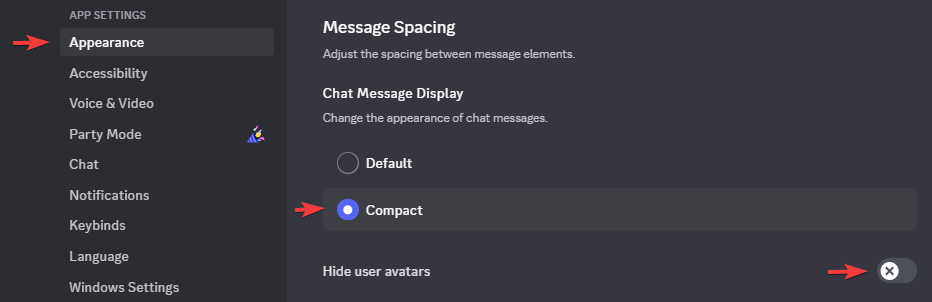
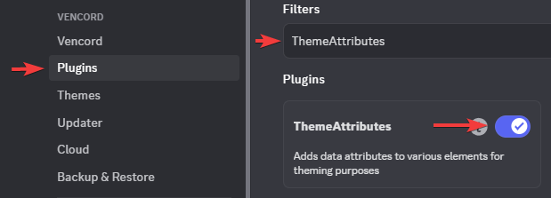
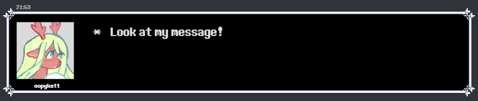
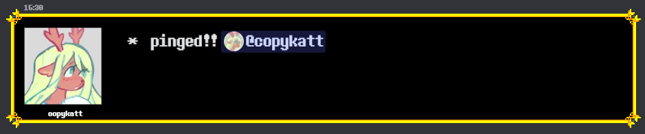
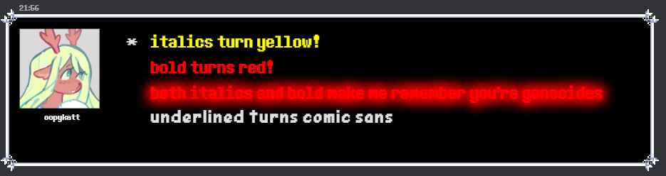
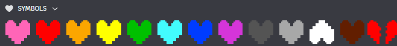
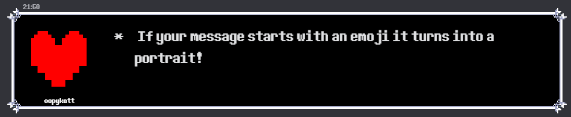
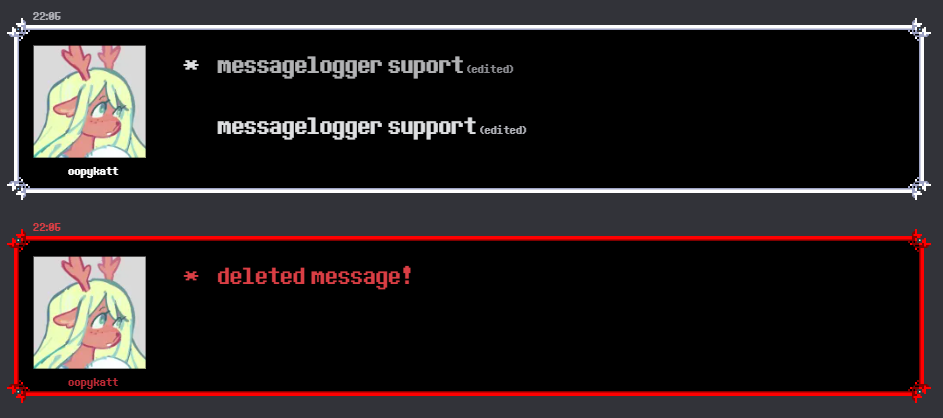
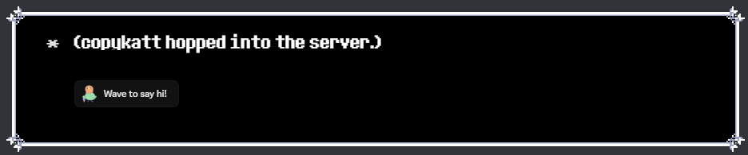

# DeltaruneTextboxesVencord
Vencord theme that makes all messages look like deltarune textboxes with some little extra features!

## Settings
The theme does not work with default chat mode yet, for now you should:
- Turn on Compact mode
- Turn off Hide user avatars

This theme uses the ThemeAttributes vencord plugin to work properly
- Profile pictures will be lower resolution without the plugin installed

## Features
- Turns all messages into deltarune dark world textboxes

  

- Colors the outline of messages that mention you

  

- Replaces default formatting with custom effects!

  
  
- Changes heart emojis to different souls

  

- If your message starts with an emoji it turns into a portrait

  

- MessageLogger plugin support

  

- System messages are formatted like flavor text

  